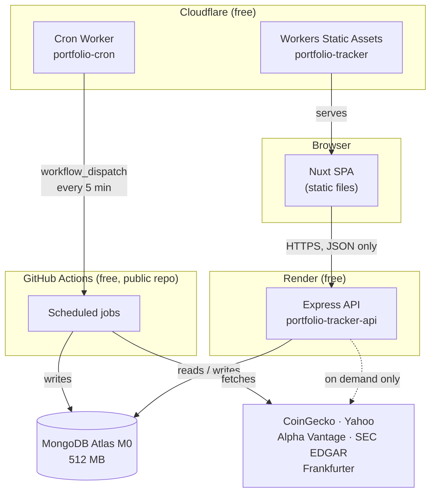
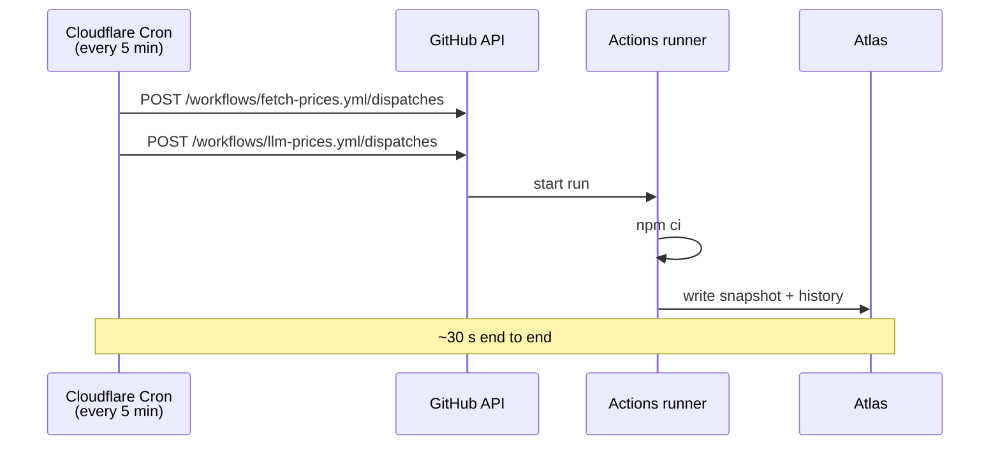
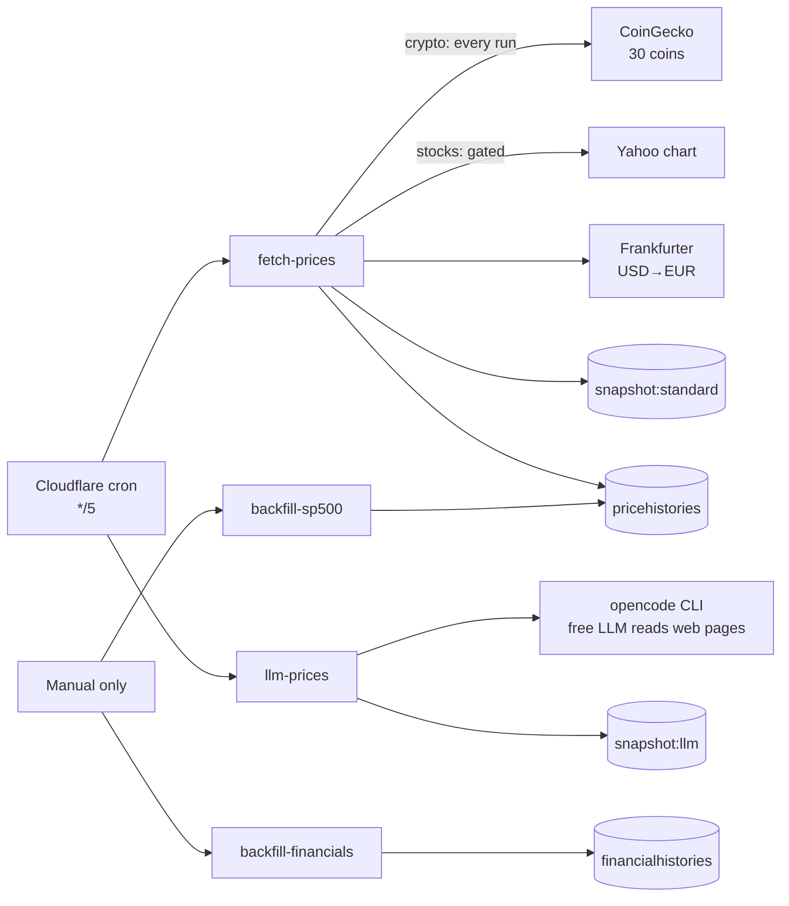
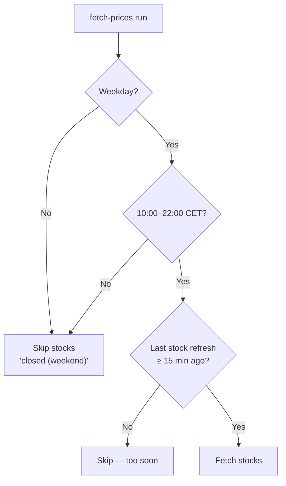
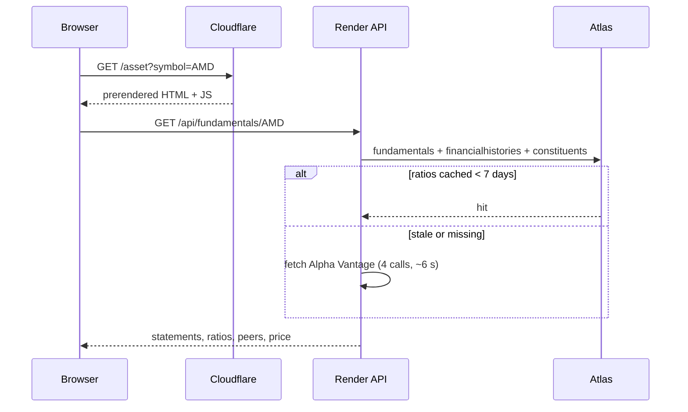

# Portfolio Tracker

Tracks a personal investment portfolio, and doubles as a research tool over the
whole S&P 500: five years of daily prices and every company's reported quarterly
financials, with per-ticker pages and side-by-side comparison.

Everything runs on free tiers. Nothing depends on a laptop being switched on.

---

## The two rules that shape everything

Most of the design follows from two decisions. If you read nothing else, read this.

**1. The browser never talks to a data provider.**
Not for prices, not for exchange rates, not for charts. Every figure the page
shows came from our own database. This is why no API key ships in the frontend
bundle, why a provider's CORS policy or rate limit can never break the UI, and
why the same number appears identically everywhere.

**2. Writers and readers share state through the database, never the filesystem.**
Jobs and the API run on *different machines* with ephemeral disks. A JSON file
written by a job is invisible to the API and vanishes on redeploy. So the price
snapshot, the rate-limit counters and everything else live in MongoDB. This was
learned the hard way — the app originally used `data/prices.json`.

---

## Where things run



The dotted line is the single exception to rule 1: the API fetches company
fundamentals on a cache miss, because those are looked up per ticker rather than
on a schedule. It still happens server-side, never in the browser.

| Piece | Host | Notes |
|---|---|---|
| Frontend | Cloudflare Workers Static Assets | Prerendered Nuxt, no cold start. Cloudflare Pages no longer accepts new projects, so this is the assets-only Worker equivalent |
| API | Render free web service | Sleeps after ~15 min idle; first request then takes ~50 s |
| Database | MongoDB Atlas M0 | 512 MB ceiling; usage is on the Admin page |
| Jobs | GitHub Actions | Unmetered minutes on a public repo |
| Clock | Cloudflare Cron Trigger | See below — this is the interesting part |

---

## The scheduling trick

The obvious design is a `schedule:` cron in each GitHub workflow. **That does not
work**, and the failure is silent.

GitHub throttles scheduled workflows hard. Measured on this repository, a
workflow asking for `*/15` actually fired at gaps of **25 to 700 minutes**:

```
12:20, 06:51, 01:20, 23:16, 21:11 …   (requested: every 15 minutes)
```

Prices went hours stale, and the only reason it wasn't obvious was that a
`launchd` agent on a laptop was quietly filling the gap — which defeated the
point of deploying at all.

`workflow_dispatch` is **not** throttled. So an external clock calls the dispatch
API instead:



Cloudflare honours the interval; GitHub does not. The Worker
([`cron-worker/src/index.js`](cron-worker/src/index.js)) holds a fine-grained
token with **Actions: write on this repo only**, stored as a Worker secret.

The `schedule:` blocks are still in the workflow files (`*/15` and `*/5`) as a
fallback — they fire occasionally and do no harm. The real cadence is whatever
the Cloudflare Worker dispatches, which is why the table below says "dispatched"
rather than quoting the cron expression.

---

## The jobs



| Workflow | Cadence | What it does |
|---|---|---|
| [`fetch-prices.yml`](.github/workflows/fetch-prices.yml) | dispatched every 5 min | Crypto every run; stocks only inside the market window; FX rate; writes `snapshot:standard` and appends to price history |
| [`llm-prices.yml`](.github/workflows/llm-prices.yml) | dispatched every 5 min | Runs the OpenCode agent, which reads BTC/ETH prices off web pages with a free LLM; writes `snapshot:llm` |
| [`backfill-sp500.yml`](.github/workflows/backfill-sp500.yml) | manual | 5 years of daily closes for all 503 members (~630k points, ~10 min) |
| [`backfill-financials.yml`](.github/workflows/backfill-financials.yml) | manual | Reported quarterly financials for all members from SEC EDGAR (~32k quarters, ~7 min) |

Both backfills are **idempotent** — writes are upserts keyed on `(symbol, ts)`
or replace a company's document wholesale — so re-running fills gaps and picks up
new quarters rather than duplicating.

### Stocks are gated; crypto is not

Crypto trades continuously, so every run refreshes it. Stocks would waste
requests overnight, so [`marketHours.js`](backend/src/jobs/marketHours.js) gates
them:



All timestamps shown in the UI are CET/CEST, computed with
`Intl.DateTimeFormat` on `Europe/Berlin` so daylight saving is handled by the
platform rather than by arithmetic.

### Rate budgeting

Free tiers have daily caps, and discovering them by being throttled is the bad
way. [`rateBudget.js`](backend/src/jobs/rateBudget.js) keeps a per-provider,
per-day counter **in the database** — a counter in a CI container would reset
every run and never bind. Reserving is a single conditional update, so two
concurrent callers cannot both slip past the cap.

| Provider | Our cap | Their limit |
|---|---|---|
| Alpha Vantage | 20/day | 25/day |
| Yahoo | 800/day | unpublished |
| CoinGecko | 2000/day | ~30/min |

Today's usage is visible on the Admin page.

---

## Data sources

| Source | Used for | Key? |
|---|---|---|
| CoinGecko | Crypto prices, crypto history | Optional demo key |
| Yahoo Finance `v8/chart` | Stock prices and history | No |
| Frankfurter | USD→EUR rate | No |
| **SEC EDGAR** | Quarterly financial statements | No, no quota |
| Alpha Vantage | Valuation ratios (P/E, forward P/E, market cap) | Yes, 25/day |
| `datasets/s-and-p-500-companies` | Index membership + GICS sectors + CIK | No |

**Why EDGAR matters.** Alpha Vantage allows 25 requests a day and a full company
costs four, so covering the index would take ~80 days and yield 8 quarters each.
EDGAR is the source those figures are derived from — free, no key, no quota, and
complete back to a company's first XBRL filing. AMD has **68 quarters from 2009**
instead of 8.

Alpha Vantage is still used for the ratios EDGAR doesn't carry, and for
earnings-versus-consensus: EDGAR has what was *reported*, never what was
*expected*.

### Two subtleties in the EDGAR data

**Missing fourth quarters.** Many companies never file Q4 alone — it's inside the
annual figure. Those quarters are derived as *year minus the three filed
quarters*, for every additive figure (revenue, gross profit, operating income,
net income, R&D). **Not EPS**: it is per share, and a changing share count makes
the same subtraction quietly wrong. Derived rows are labelled `derived` in the UI
and reconcile with Alpha Vantage to within 0.1%.

Matching is done on *reported period dates*, not EDGAR's `fy`/`fp` labels — those
describe the filing's fiscal context, not the period, and using them produced
figures 20% wrong.

**Different fiscal calendars.** For the same business quarter AMD closes 27 June,
Tesla 30 June, NVIDIA 26 July. Grouping on the exact end date gives every company
its own column and a comparison chart full of holes. Quarters are bucketed into
the calendar quarter they belong to, shifting back six weeks first so a late-July
close lands with the June ones.

---

## Data model

| Collection | Shape | Written by |
|---|---|---|
| `users` | One per account; bcrypt hash | Signup |
| `assets` | Holdings | User |
| `snapshots` | **Two documents**: `standard` and `llm`, each the whole current price payload | Jobs |
| `pricehistories` | One point per `(symbol, ts)`; ~656k rows | Jobs + backfill |
| `financialhistories` | One document per company, holding its quarters | EDGAR backfill |
| `constituents` | 503 S&P members with GICS sector and CIK | S&P job |
| `fundamentals` | Ratios per ticker, cached 7 days | API, on demand |
| `ratebudgets` | One document per CET day | Jobs |

Snapshots are one document per source replaced wholesale — there is nothing to
invalidate, and a reader either sees the old payload or the new one.

---

## What happens when you open a page



A cold ticker takes ~6 seconds once, then is instant for a week. Statements come
from EDGAR and are already there. Peers come from the GICS sub-industry — an
actual peer group, not "what people also viewed", which used to put Netflix
beside AMD.

Requests for the same ticker share one in-flight fetch, so a double-click cannot
spend the daily budget twice.

---

## The LLM price agent

A toggle on the dashboard switches between the standard feed and prices read off
web pages by a free LLM via the [OpenCode](https://opencode.ai) CLI — no
market-data API involved.

It runs **in GitHub Actions, not on Render**. Spawning `opencode` on the 512 MB
free instance got the API process OOM-killed and took login down with it, so the
in-process refresher is off unless `LLM_REFRESH=on`
([`llmRefresher.js`](backend/src/agents/llmRefresher.js)). A stale price is a far
better failure than a broken login.

The honest trade: on a real machine this refreshes every ~8 seconds. On a
5-minute cron it does not. The dashboard reports the snapshot's *age* rather than
a poll count, because a counter climbs whether or not the data ever moves.

---

## Local development

Local is deliberately **isolated from production**: `backend/.env` points at a
local MongoDB, so nothing on a laptop can write to the deployed database.

```bash
npm run install:all

# MongoDB 8.0 under ~/.local/mongodb, kept alive by a launchd agent
launchctl load ~/Library/LaunchAgents/local.mongodb.plist

cp backend/.env.example backend/.env    # already points at 127.0.0.1
npm run dev:backend                     # :4000
npm run dev:frontend                    # :3000
```

Useful one-offs:

```bash
node backend/src/jobs/fetchPrices.js              # one price refresh
node backend/src/jobs/backfill.js --sp500         # 5y history, whole index
node backend/src/jobs/backfillFinancials.js AMD   # EDGAR for one company
node backend/src/agents/opencodePriceAgent.js --once
```

## Deploying

- **Frontend** — `cd frontend && npm run deploy`. That one script bakes the
  production API URL, checks the output, and uploads; run the three steps by
  hand and `nuxt generate` will read `frontend/.env` and quietly ship the
  local API URL to every visitor. `npm run check:build` refuses a build
  containing any `localhost:<port>`, which is the only symptom that failure
  has until someone tries to log in.
  Output is `.output/public`; the `dist` symlink is a trap most hosts won't follow.
- **API** — Render deploys `main` automatically from [`render.yaml`](render.yaml).
- **Cron Worker** — `cd cron-worker && npx wrangler deploy`.

See [DEPLOYMENT.md](DEPLOYMENT.md) for first-time setup.

## Admin

`/admin` is visible only to the address in [`admins.js`](backend/src/admins.js)
(override with `ADMIN_EMAILS`). Admin status is **derived per request**, never
carried in the token — a claim minted at login would outlive a revocation by the
rest of its 7-day life. The frontend guard only hides the link; the API enforces
access itself.

It shows database usage against the 512 MB ceiling with a per-collection
breakdown, how stale each feed is, today's provider budget, and the API's memory.

## Known limits

- **~6 new companies a day** can have their ratios fetched (25 Alpha Vantage
  requests ÷ 4). Cached ones are unlimited. Statements are unaffected — EDGAR has
  no quota.
- **Price and financial history are snapshots**, refreshed by re-running the
  backfills. The 5-minute job only tracks held assets; 503 tickers every 5 minutes
  would be ~145k requests a day.
- **Only S&P 500 members** are covered. `TSM` and `ARM` are not in the index, so
  they have no history and no statements.
- **The API sleeps** after ~15 minutes idle on Render's free plan.
